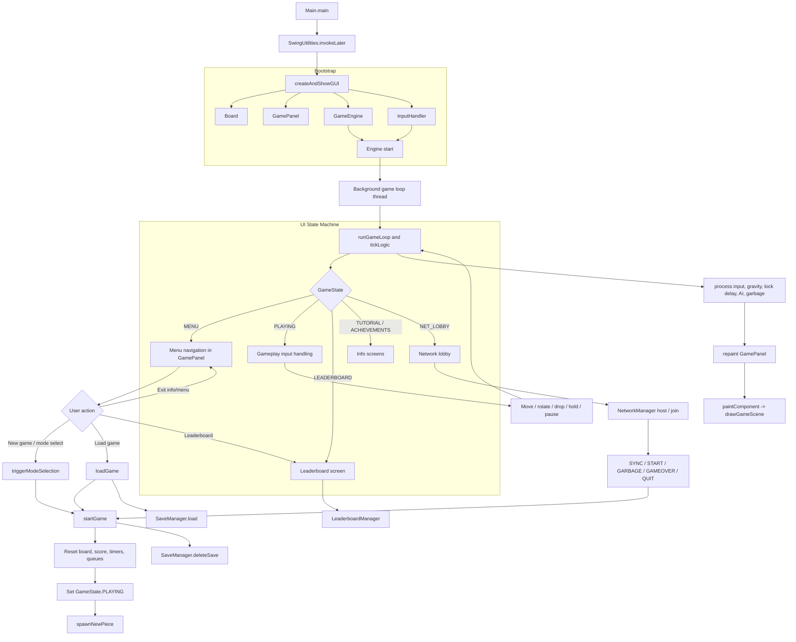
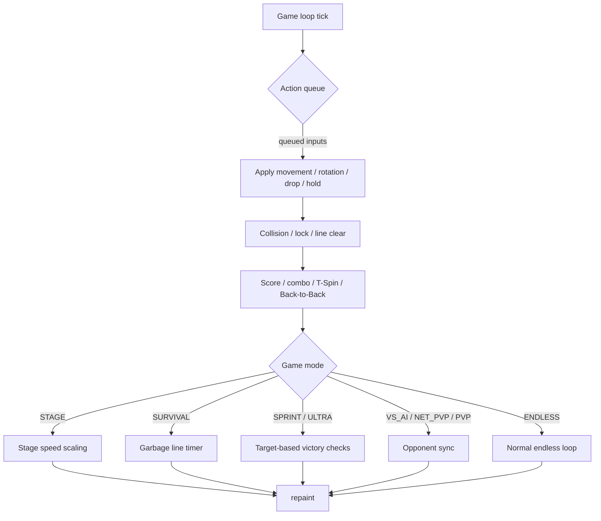

<a id="top"></a>

# Tetris

Java + Swing 實作的俄羅斯方塊專案，提供完整可玩的 Tetris 體驗，並整合遊戲邏輯、UI、音效、存檔、排行榜、成就與多種遊玩模式。

<p align="center">
  <a href="#zh">中文</a> · <a href="#en">English</a>
</p>

<a id="zh"></a>

## 中文

### 專案特色

- 完整的俄羅斯方塊核心玩法：方塊生成、移動、旋轉、碰撞、鎖定與消行
- 支援多種遊戲模式：`STAGE`、`ENDLESS`、`SURVIVAL`、`SPRINT`、`ULTRA`、`VS_AI`、`LOCAL_PVP`、`NET_PVP`
- 難度切換：可在遊戲中即時切換 `EASY`、`NORMAL`、`HARD`
- 進階判定：`T-Spin`、`Combo`、`Back-to-Back`、垃圾列規則
- UI 與視覺效果：下一塊預覽、Hold、側欄資訊、得分動畫、粒子效果、成就提示
- 遊戲周邊功能：本地排行榜、存檔、音效與背景音樂、語言切換、主題切換、色盲模式
- 測試支援：內建遊戲邏輯測試，可獨立執行驗證核心規則

### 操作說明

- 左右方向鍵：移動方塊
- 上方向鍵：旋轉方塊
- 下方向鍵：加速下落
- 空白鍵：Hard Drop，直接落到底並鎖定
- P 或 Esc：暫停或恢復遊戲

### 已實作功能

- 七種 Tetromino 方塊與基本移動、旋轉機制
- 消行與計分
- 難度速度控制
- 下一塊預覽與 Hold
- 暫停、結束判定與重新開始流程
- 排行榜管理
- 存檔與設定保存
- 音效與背景音樂管理
- AI 對戰與網路對戰相關模組
- 主題、語言與可視化調整功能
- 單元測試與測試啟動器

### 執行需求

- 直接執行：`Tetris.jar`
- 執行 `Tetris.jar` 時需要安裝 `JRE 17` 或以上
- 若要自行編譯原始碼，則需要 `JDK 17` 或以上
- Windows 環境可直接使用提供的批次檔
- 其他平台可用 `javac` 與 `java` 手動編譯執行

### 啟動方式

#### 方式一：使用批次檔

在專案根目錄下執行：

```bat
build_and_run.bat
```

#### 方式二：手動編譯與執行

```bash
mkdir bin
javac -d bin src/com/tetris/main/Main.java src/com/tetris/controller/*.java src/com/tetris/model/*.java src/com/tetris/view/*.java src/com/tetris/util/*.java src/com/tetris/test/*.java
java -cp bin com.tetris.main.Main
```

若要依照 `manifest.txt` 打包成可執行 JAR，也可把 `Main-Class` 指向 `com.tetris.main.Main`。

### 測試

如需執行遊戲邏輯測試，可使用專案提供的測試腳本：

```bat
run_tests.bat
```

或直接執行測試入口類別 `com.tetris.test.TestRunner`。

### 專案結構

```text
Tetris/
  src/
    com/tetris/main/Main.java
    com/tetris/controller/
      GameEngine.java
      InputHandler.java
      LeaderboardManager.java
    com/tetris/model/
      Board.java
      GameMode.java
      LeaderboardEntry.java
      Piece.java
      Tetromino.java
    com/tetris/util/
      AchievementManager.java
      LanguageManager.java
      NetworkManager.java
      SaveManager.java
      SoundManager.java
      TetrisAI.java
      ThemeManager.java
    com/tetris/view/
      GamePanel.java
      IPInputDialog.java
      MessageDialog.java
    com/tetris/test/
      GameLogicTest.java
      TestRunner.java
  README.md
  README_ZH.md
  README_EN.md
  build_and_run.bat
  run_tests.bat
  manifest.txt
```

### 版本資訊

- 目前專案版本：`3.0.2`

<a id="en"></a>

## English

### Overview

This is a Java and Swing-based Tetris project. The goal is to provide a complete, playable Tetris experience with game logic, UI, sound, save/load, leaderboard, achievements, and multiple game modes.

### Features

- Full Tetris core gameplay: piece generation, movement, rotation, collision, locking, and line clears
- Multiple game modes: `STAGE`, `ENDLESS`, `SURVIVAL`, `SPRINT`, `ULTRA`, `VS_AI`, `LOCAL_PVP`, `NET_PVP`
- In-game difficulty switching: `EASY`, `NORMAL`, `HARD`
- Advanced rules: `T-Spin`, `Combo`, `Back-to-Back`, and garbage line handling
- UI and visual effects: next piece preview, Hold, sidebar information, score popups, particle effects, and achievement toasts
- Extra systems: local leaderboard, save/load, sound and background music, language switching, theme switching, and color-blind support
- Test support: built-in game logic tests that can be run independently to verify core rules

### Controls

- Left / Right Arrow: move the piece
- Up Arrow: rotate the piece
- Down Arrow: soft drop
- Space: hard drop, instantly place the piece
- P or Esc: pause or resume the game

### Implemented Features

- Seven Tetromino pieces with basic movement and rotation
- Line clear and scoring
- Difficulty-based drop speed control
- Next piece preview and Hold
- Pause, game over detection, and restart flow
- Leaderboard management
- Save and settings persistence
- Sound effects and background music management
- AI battle and network battle related modules
- Theme, language, and accessibility customization
- Unit tests and a test launcher

### Requirements

- To run `Tetris.jar` directly: `JRE 17` or later
- To compile the source code yourself: `JDK 17` or later
- On Windows, you can use the provided batch files
- On other platforms, you can compile and run manually with `javac` and `java`

### How to Run

#### Option 1: Use the batch file

Run the following from the project root:

```bat
build_and_run.bat
```

#### Option 2: Compile and run manually

```bash
mkdir bin
javac -d bin src/com/tetris/main/Main.java src/com/tetris/controller/*.java src/com/tetris/model/*.java src/com/tetris/view/*.java src/com/tetris/util/*.java src/com/tetris/test/*.java
java -cp bin com.tetris.main.Main
```

If you want to package the project as an executable JAR according to `manifest.txt`, set `Main-Class` to `com.tetris.main.Main`.

### Testing

To run the game logic tests, use the provided test script:

```bat
run_tests.bat
```

You can also run the test entry point directly with `com.tetris.test.TestRunner`.

### Project Structure

```text
Tetris/
  src/
    com/tetris/main/Main.java
    com/tetris/controller/
      GameEngine.java
      InputHandler.java
      LeaderboardManager.java
    com/tetris/model/
      Board.java
      GameMode.java
      LeaderboardEntry.java
      Piece.java
      Tetromino.java
    com/tetris/util/
      AchievementManager.java
      LanguageManager.java
      NetworkManager.java
      SaveManager.java
      SoundManager.java
      TetrisAI.java
      ThemeManager.java
    com/tetris/view/
      GamePanel.java
      IPInputDialog.java
      MessageDialog.java
    com/tetris/test/
      GameLogicTest.java
      TestRunner.java
  README.md
  README_ZH.md
  README_EN.md
  build_and_run.bat
  run_tests.bat
  manifest.txt
```

### Version

- Current project version: `3.0.2`

## License

No license has been specified yet.

Issues and pull requests are welcome.

## Simplified Flowchart

A compact, README-friendly overview of the runtime/gameplay flow.

```mermaid
flowchart TD
  Main[Main.main] --> Bootstrap[Create GUI (Board, GamePanel, GameEngine, InputHandler)]
  Bootstrap --> Engine[GameEngine]
  Bootstrap --> Panel[GamePanel]
  Bootstrap --> Input[InputHandler]

  Engine --> Loop[Game loop]
  Loop --> State{GameState}
  State -->|MENU| Menu[Menu screen]
  State -->|PLAYING| Play[Gameplay]

  Menu -->|Start| Start[startGame]
  Start --> Reset[Reset board, score, timers]
  Reset --> Play

  Play --> Actions[Process input / gravity / lock / garbage]
  Play --> Render[Render GamePanel]
  Play --> Save[SaveManager]

  Menu --> Leaderboard[Show leaderboard]
  Menu --> NetLobby[Network lobby]
  NetLobby --> Network[NetworkManager]
```

## Tetris Project Flow Chart

This diagram shows the main runtime flow of the project, from application startup to gameplay, UI state changes, and persistence-related paths.




